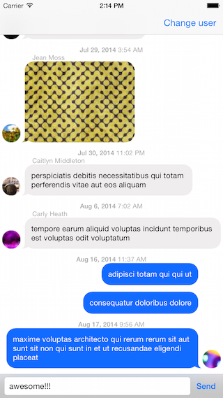
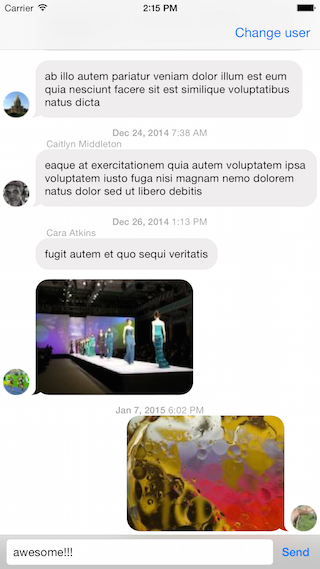

# AsyncMessagesViewController

A smooth, responsive and flexible messages UI library for iOS. Built on top of the awesome [AsyncDisplayKit](https://github.com/facebook/AsyncDisplayKit) framework, it takes full advantage of asynchronous sizing, (non-auto) layout and text rendering to deliver a 5x fps (subject to increase) scrolling experience.

 &nbsp;&nbsp; 

## Dependencies
* [AsyncDisplayKit](https://github.com/facebook/AsyncDisplayKit)
* [SlackTextViewController](https://github.com/slackhq/SlackTextViewController) (to take advantages of its awesome features and customizations. Why reinvent the wheel?)

## Requirements
* (Tested on) iOS 8
* ARC
* Swift (supporting Objective-C should be possible, please create an issue if you need).

## Installation
### From [CocoaPods](http://cocoapods.org):

````ruby
pod 'AsyncMessagesViewController'  
````

Can't do it? Well I'm sorry but the pod won't be available until AsyncDisplayKit hits v1.2.

### Without CocoaPods
Copy the `Source\` directory to your project and install all dependencies.

##How to use
* **Example project**
  * Run `pod install`.
  * Open `AsyncMessagesViewController.xcworkspace`.
  * Enjoy the simple `ViewController.swift` class.
* **Model**
  * Your message model object should conform to `MessageData` protocol.
* **View**
  * `MessageCellNode` is your friend. Most of the time you don't want to subclass it.
  * There are 2 basic built-in bubble nodes implemented for you: `MessageTextBubbleNode` for text based messages and `MessageNetworkImageBubbleNode` for remote image based messages.
  * Need a custom bubble node? [Here you go](#customizations)
* **Controller**
  * Your view controller should subclass `AsyncMessagesViewController`. As you may see, it's a very simple view controller (and [should be](http://www.objc.io/issue-1/lighter-view-controllers.html)). Most of the magic is in the data source.
  * What data source, you may ask. Any data source that conform to `AsyncMessagesCollectionViewDataSource` protocol.
  * There is a default implemention: `DefaultAsyncMessagesCollectionViewDataSource`. This class keeps a sorted list of messages, but doesn't allow you to change them directly. Instead, you must alter messages using given methods in its protocol and let it handle the heavy work. It can (supposedly) smartly determine which cells need to be inserted, deleted and reloaded. Why? because:
    * Calling `reloadData` is very expensive on `ASCollectionView` (and `ASTableView`). 
    * Most of the time, inserting/deleting a cell causing UI changes in other cells as well. `DefaultAsyncMessagesCollectionViewDataSource` can detect those changes automatically.
  * `MessageCellNodeMetadata` provides runtime-computed information about a message and how its data should be presented in a `MessageCellNode`. Metadata of a message is often computed based on the relationship with other messages. For example, message's sender name should be displayed if it is an incoming message and is the first one in a set of consecutive messages sent by a same user. Or message's date should be shown if it is the first message sent within a 15 minutes window. This kind of UI logic is encapsulated in `MessageCellNodeMetadataFactory` and computed at runtime. Of course you can [implement your own logic](#customizations).

##Customizations
  * Custom bubble node
    * Please read [this guide](http://asyncdisplaykit.org/guide/2) on writting a custom `ASDisplayNode`.
    * Inject your own bubble node by overriding `DefaultAsyncMessagesCollectionViewDataSource.bubbleNodeForMessage(MessageData, MessageCellNodeMetadata)`.
  * Custom bubble image's colors
    * Initiate a `MessageBubbleImageProvider` with whatever colors you want.
    * Inject the provide to `DefaultAsyncMessagesCollectionViewDataSource` via its initializer.
    * Inject the data source to `AsyncMessagesViewController` (also via its initializer).
  * Custom bubble images
    * Implementing your own `MessageBubbleImageProvider`.
    * Inject it to the data source.
    * Inject the data source to the view controller.
  * Custom logic for computing cell metadata
    * Subclass `MessageCellNodeMetadataFactory` and override any neccessary method.
    * Inject it to the data source.
    * Inject the data source to the view controller.
  * Custom format for message date
    * Subclass `MessageTimestampFormatter` and override `attributedTimestamp(NSDate)`.
    * Inject it to the data source.
    * Inject the data source to the view controller.
  * Any customization related to the input toolbar:
    * Please take a look at [SlackTextViewController](https://github.com/slackhq/SlackTextViewController) itself.
  * Other customizations:
    * File an issue and I will be more than happy to help :)
    
##Contribute
This project is still very young. All feedbacks, questions and pull requests are very welcome.

##Credits
Created by [Huy Nguyen](http://huytnguyen.me), an Android developer :)
* Inspried by [JSQMessagesViewController](https://github.com/jessesquires/JSQMessagesViewController) and [Atlas](https://github.com/layerhq/Atlas-iOS).
 
##License
`AsyncMessagesViewController` is released under an [MIT License](http://opensource.org/licenses/MIT). See `LICENSE` for details.

>**Copyright &copy; 2015 Huy Nguyen.**
